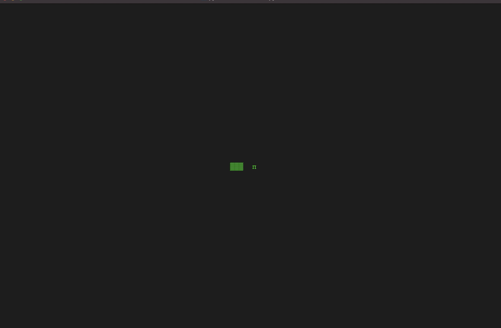

# Snake

 Run this Python script to play the classic game, "Snake" in your terminal.

 ## Instructions

* Open terminal
* Change directory to the root of this project (where this README.md file is located)
* Run the following command: `python snake.py`
* Observe the output (game should start)
* Use the arrow keys to move the snake around
* Collect as many pieces of food as possible
* Don't hit the walls or yourself!
* To quit the game, press the "q" key
  

